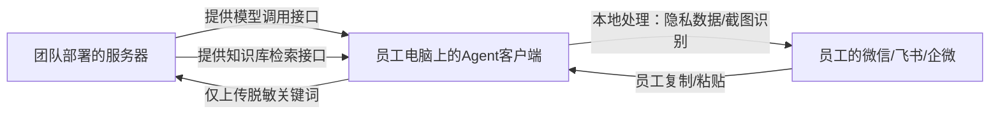

**模型调用的完整链路、服务器部署细节、知识库本地/云端的存储规则+场景区分**

核心逻辑：**团队统一部署模型和知识库，员工只装轻量客户端调用，本地存隐私数据、云端存通用/行业数据**

### 一、核心架构

核心结论：
- ✅ 模型/知识库由你团队**统一部署在云服务器**，员工完全不用碰“部署、配置”；
- ✅ 员工只装一个轻量客户端（<100MB），通过网络调用你服务器的接口；
- ✅ 隐私数据（比如完整聊天记录）只在员工本地处理，绝不传服务器；
- ✅ 只有脱敏后的“行业关键词/通用问答”存在云端，供全公司复用。

### 二、模型调用的具体落地步骤（小团队7-8月demo版，成本<1000元/月）
#### 步骤1：选服务器（低成本、易部署）
- **选型**：阿里云/腾讯云「轻量应用服务器」（2核4G内存，足够跑7B量级的开源模型）；
- **成本**：每月约80-150元（按年付更便宜）；
- **系统**：选Ubuntu 20.04（Linux系统，部署模型更稳定）。

#### 步骤2：选开源模型（轻量化、易部署、适配行业）
不用选大模型，优先“小而精”，demo阶段足够用：
| 模型类型       | 具体选择                | 优势                          | 部署难度 |
|----------------|-------------------------|-------------------------------|----------|
| 对话/问答模型  | Qwen2-7B-Chat（量化版） | 中文效果好、轻量化、适配行业问答 | 低       |
| 知识库检索模型 | BGE-small-zh            | 轻量、关键词检索准确率高      | 低       |

#### 步骤3：部署模型+开发调用接口（算法同学做，1-2周搞定）
1. **部署模型**：
   - 用`FastChat`/`vLLM`（开源部署工具）一键部署Qwen2-7B，量化后占用内存<8G，2核4G服务器能跑；
   - 部署后，服务器会生成一个“模型调用接口”（比如`http://你的服务器IP:8000/chat`）。
2. **开发极简接口**：
   - 算法同学写一个简单的HTTP接口，只开放“电子皮肤行业问答”功能，屏蔽模型的复杂参数；
   - 接口参数只接收“脱敏关键词”（比如`{"question": "电子皮肤 -10℃ 工作"}`），不接收完整聊天记录；
   - 接口返回“行业精准回答”（比如`{"answer": "X3型号可在-20℃~60℃稳定工作，附测试报告链接"}`）。

#### 步骤4：员工客户端对接接口（兜底同学做，1周搞定）
- 客户端里写一行代码，调用你服务器的接口（比如用Python的`requests`库）；
- 加“失败重试”“超时提示”：比如网络不好时，提示“稍等，正在连接服务器”，不会卡壳；
- 员工完全看不到接口地址/参数，只看到“输入问题→出回答”的界面。

#### 关键补充：什么时候用云端大模型API兜底？
不是完全不用，而是“开源模型搞不定时才用”：
- 比如客户问极冷门的问题（开源模型答不上），客户端自动调用一次GPT-3.5/文心一言API（按量付费，成本极低）；
- 给老板看的“成本报表”里，标注“95%的问答用自研模型，5%用云端API兜底”，融资时更有说服力。

### 三、知识库的存储规则：本地vs云端（按“隐私/复用”划分，绝对安全）
#### 先明确：哪些数据存本地？哪些存云端？
| 存储位置 | 存储内容                                  | 场景/目的                                                                 | 安全保障                          |
|----------|-------------------------------------------|--------------------------------------------------------------------------|-----------------------------------|
| 员工本地 | 1. 完整聊天记录（微信/飞书） 2. 截图原始文件 3. 员工个人回答习惯 | 1. 隐私保护（不泄露客户/公司敏感信息） 2. 本地快速提取关键词（不用传服务器） | 1. 数据只存在员工电脑 2. 可选“加密存储” |
| 你团队云端服务器 | 1. 电子皮肤行业通用知识库（高频问答+标准答案） 2. 公司专属知识库（客户意向规则、产品参数） 3. 脱敏后的关键词（如“-10℃、精度0.1mm”） 4. 全公司客户意向统计数据 | 1. 全公司复用（所有员工都能调用标准答案） 2. 沉淀公司资产（不会因员工离职丢失） 3. 统计分析（老板看“哪些问题客户问得最多”） | 1. 仅对公司内网开放 2. 关键词脱敏，无完整信息 3. 定期备份 |

#### 本地+云端的协同逻辑（举例：电子皮肤项目场景）
1. 员工和客户在飞书聊：“你们的电子皮肤精度能到0.1mm吗？防水怎么样？”；
2. Agent客户端**本地处理**：
   - 提取关键词“精度0.1mm、防水”（不提取完整聊天记录）；
   - 本地判断：这是工作相关关键词，需要调用云端知识库；
3. 客户端**仅上传关键词**到你服务器；
4. 服务器检索云端知识库，返回“精度0.1mm是标准版参数，防水IP67，适配工业场景”；
5. 客户端**本地展示+粘贴**：把回答放到悬浮窗，员工一键粘贴到飞书；
6. 服务器**只记录关键词**（“精度0.1mm、防水”），用于后续统计（比如“本月客户问防水的有20次”），不记录完整对话。

### 四、demo阶段的简化版（先落地，不贪全）
如果觉得服务器部署/接口开发有点复杂，demo阶段可以先“极简版”：
1. 你团队用一台高配电脑（代替云服务器），部署模型和知识库；
2. 仅限公司内网访问（员工连公司WiFi就能调用）；
3. 知识库先手动整理50条电子皮肤高频问答（比如“精度、防水、交付周期”），不用做复杂的检索；
4. 客户端只做“复制关键词→调用内网接口→返回回答→一键粘贴”，核心功能先跑通。

### 五、核心成本&难度总结（小团队完全扛得住）
| 环节       | 成本（每月） | 开发难度 | 负责同学       |
|------------|--------------|----------|----------------|
| 云服务器   | 80-150元     | 低       | 兜底同学（部署） |
| 开源模型   | 0元（免费）  | 中       | 算法同学       |
| 接口开发   | 0元          | 低       | 算法同学       |
| 客户端开发 | 0元          | 低       | 兜底同学       |
| 云端API兜底 | <50元（按量） | 低       | 算法同学       |

### 总结
1. 模型调用：你团队统一部署在云服务器，提供极简接口，员工客户端调用，全程无感知；
2. 知识库存储：本地存隐私/完整数据，云端存脱敏/通用数据，既安全又能复用；
3. demo阶段先极简落地（内网+50条问答），7-8月能跑通核心流程，融资后再优化成外网+全量知识库。

这样做的核心优势：
- 员工侧：零部署、零配置、零隐私顾虑，只用点一下就能用；
- 你团队侧：掌控核心模型/知识库，形成壁垒，不用依赖大厂API；
- 融资侧：能讲清“自研模型+私有化部署+行业深度”，比纯调用大厂API更有价值。
